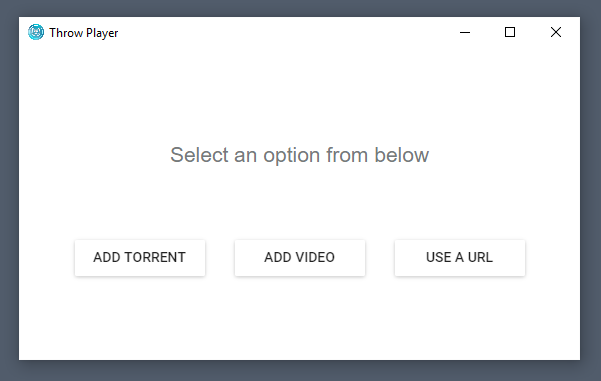
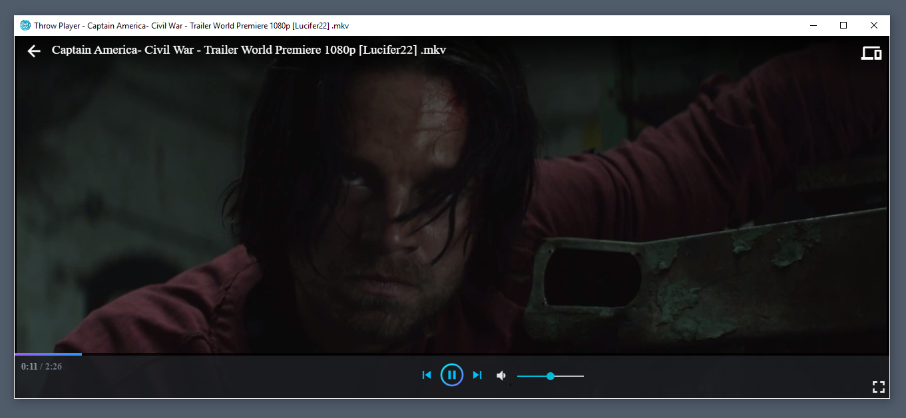
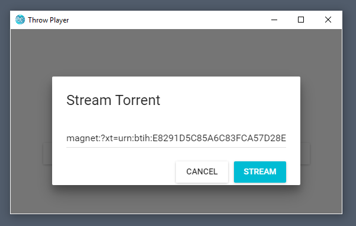

# Throw Player

### Requirements

 - PC running Windows 7 or above.

### Screenshots





### Where's the beef!

Pre-built binarys & setup files can be found in the [Releases Tab](https://github.com/Magics-Group/throw-client/releases).

<br>


### Getting Started

- `npm install`

To run the app in development:

- `npm start`

Running `npm start` will download and install [Electron](http://electron.atom.io/).

### Building & Release

- `npm run release`

## Architecture

### Overview

Throw is an application built using [electron](https://github.com/atom/electron). While it's work in progress, the goal is to make Throw a high-performance, portable Javascript ES6 + ES7 application built with React and Flux (using [alt](https://github.com/goatslacker/alt). It adopts a single data flow pattern:

```
╔═════════╗       ╔════════╗       ╔═════════════════╗
║ Actions ║──────>║ Stores ║──────>║ View Components ║
╚═════════╝       ╚════════╝       ╚═════════════════╝
     ^                                      │
     └──────────────────────────────────────┘
```

There are three primary types of objects:
- **Actions**: Interact with the system
- **Views**: Views make up the UI, and trigger available actions.
- **Stores**: Stores store the state of the application.

and since Throw has a large amount of interaction with outside systems, we've added utils:
- **Utils**: Utils interact with APIs, outside systems, CLI tools and generate. They are called by user-generated actions and in return, also create actions based on API return values, CLI output etc.

### Guidelines

- Avoid asynchronous code in Stores or Views. Instead, put code involving callbacks, promises or generators in utils or actions.

## Copyright and License

Code released under the [GPLv3](LICENSE).
